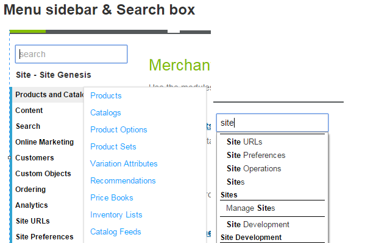

# BM Extender

A chrome extension that adds custom functionality to the DW BM.

## Features

### BM functionality
- sidebar menu
- search functionality in the sidebar 
- fill the export input with some default value
- action buttons with position fixed
- highlight the current row in a table
- keep the session active
- small layout fixes
- update the page title with more useful information
- dark mode (enabled from options menu)

### Popup functionality
- Links to common places
- Logs from today

## Caching
In order for the sidebar to load faster we cache the menu received via ajax
in SessionStorage.  
**If something changes in the menu and you want to update the sidebar
you will need to delete the SessionStorage from your DevTools**  
The SessionStorage are prefixed with `dwre-sidebar-`.

## Install
**For usage**

- In Chrome go to -> [chrome://extensions/](chrome://extensions/) -> check the developer
mode -> Load unpacked extension -> select the `src/` folder for this repo  

**For development**

- In Chrome go to -> [chrome://extensions/](chrome://extensions/) -> check the developer
mode -> Load unpacked extension -> select the `src/` folder for this repo  
- Change the code and test it in the browser.

## Contributions
Please open an [issue](https://github.com/ionutvmi/bm-extender/issues) if you find any problems.  
Pull requests are welcomed.

## Release notes
- 1.11.0
    - Updates the styles for the BM badge.

- 1.10.0
    - Increases the font size for the site badge.

- 1.9.0
    - Adds support for the dark mode.
    The dark mode can be enabled from the options page.

- 1.8.1
    - Fixes the compatibility with the new BM menu layout

- 1.8.0
    - Updated the layout of the popup to make it wider
    - Increased the size of the log tail
    - Added the link to the unofficial SFCC site

- 1.7.6
    - Updates the URL pattern to allow support for custom domains on the staging instance.
- 1.7.5
    - Restricted permissions to the active tab and the SFCC urls to match the new 
    chrome web store review process. #3
    - Fixes the logs view conflict with other chrome extensions. #2

- 1.7.0
    - Implements the log tail functionality
    - Fixes the wrapping element for the sidebar on angular ui pages
    - Adds the last section teacking logic for the angularUI pages
    - Adds the initial version of the most recently visited links
    - Adds the initial structure for tracking the visited pages
    - Adds a configuration option to disable the site backhround change
    - Adds the background site change functionality.
    - Updates the links in the popup header. 
    - Adds the search highlight

- 1.6.0
    - Adds the current version and the Report issues link the popup page
    - Fixes the initialization of the JsDiff plugin, upgraded the plugin to v4
    - Adds the sidebar on the angular ui pages
    - Improves the error handling and the retention of the last open instance
    - Updates the description of the extension
    - Makes the log file filtering case insesitive

- 1.5.0
    - Fixes the display of the sticky buttons on the order preferences page.
    - Adds the lock button to the sticky action items.
    - Implements the catalogs list sub-menu items.

- 1.4.0
    - Implemented an options page where you can tweak the available preferences.
    - The options can be accessed by clicking on the Edit options link from the popup 
    or by right clicking on the extension icon > edit options
    - The localStorage preference items are no longer supported

- 1.3.0
    - Stared doing release notes
    - Add support for inline diff on textareas by using [jsDiff](https://github.com/kpdecker/jsdiff)
    - Added the filter input in the logs popup
    - Added support for some preferences:
        - `localStorage.setItem('bm-extender-included-domains', location.host)`
            - comma separated list of location.host values
            - can be used to enable the logs popup on custom domains
        - `localStorage.setItem('bm-logs-replace-escaped', true)`
            - if enabled it will replace the escaped characters `<>"` in the logs
            - note that this will alter the logs content, enable only for preview

## License
MIT (c)Mihai Ionut Vilcu 
